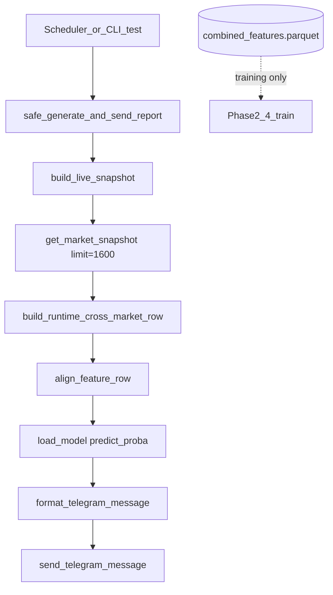

# CSFFM — Crypto Statistical Factor Filtering Model

**CSFFM Telegram Bot** 為 Phase 6 產出（**V3 runtime**）：以 Data Lake 上**離線訓練**的 **Random Forest（RF）** 固定 `.pkl`，推論時從 **Binance 1600 根 1m K 線** 在記憶體中重算 50 維特徵後 `predict_proba`，透過 Telegram 定時／手動推播 BTC／ETH 預測與期權賣方履約價建議。

**Target audience / 目標讀者：** 財務工程、Quant researcher、Crypto derivatives researcher

---

## 目錄 | Table of Contents

- [專案介紹 | Project Overview](#專案介紹--project-overview)
- [架構概覽 | Architecture](#架構概覽--architecture)
- [Bot 指令 | Bot Commands](#bot-指令--bot-commands)
- [排程時間 | Schedule](#排程時間--schedule)
- [資料期間與樣本數 | Data Period & Sample Sizes](#資料期間與樣本數--data-period--sample-sizes)
- [特徵工程 | Feature Engineering](#特徵工程--feature-engineering)
- [Labels](#labels)
- [VPIN](#vpin)
- [Random Forest 方法 | RF Methodology](#random-forest-方法--rf-methodology)
- [OOS 評估 | OOS Evaluation](#oos-評估--oos-evaluation)
- [V3 Runtime Inference](#v3-runtime-inference)
- [Live Inference（Binance）](#live-inferencebinance)
- [Data Lake vs Live Runtime](#data-lake-vs-live-runtime)
- [履約價計算 | Option Strike Calculation](#履約價計算--option-strike-calculation)
- [特徵一致性檢查 | Feature Consistency Check](#特徵一致性檢查--feature-consistency-check)
- [安裝與執行 | Install & Run](#安裝與執行--install--run)
- [風險聲明 | Risk Disclaimer](#風險聲明--risk-disclaimer)
- [已確認資訊清單 | Verified Facts](#已確認資訊清單--verified-facts)

---

## 專案介紹 | Project Overview

| | 中文 | English |
|---|------|---------|
| **名稱** | CSFFM（Crypto Statistical Factor Filtering Model） | Same |
| **Phase 6 目標** | 長期運行的 Telegram 通知機器人：排程推播、容錯 fallback、VPIN 微結構摘要、RF 預測、動態履約價 | Long-running Telegram notifier: scheduled reports, fallback, VPIN summary, RF predictions, dynamic strikes |
| **資產** | BTCUSDT、ETHUSDT（Binance 現貨 1m） | BTCUSDT, ETHUSDT (Binance spot 1m) |
| **部署模型 regime** | `all_day`（見 `bot/config.py` → `PREDICTION_REGIME`） | Production inference uses `all_day` regime only |
| **特徵維度** | 50（`btc_` + `eth_` 各 25 欄） | 50 features (25 per symbol, prefixed) |
| **詳細規格** | [`PHASE6_CSFFMtelegram_bot.md`](PHASE6_CSFFMtelegram_bot.md) | Phase 6 design doc |

---

## 架構概覽 | Architecture

```text
Data Lake (Parquet)                    Binance Public API
  ├─ raw 1m K 線                         ├─ /ticker/price
  ├─ combined_features (25/symbol)       └─ /klines (1m)
  └─ combined_labels (5/symbol)
           │                                      │
           └──────────┬───────────────────────────┘
                      ▼
            bot/live_feature_pipeline.py
              └─ 末筆 50 維 X_row（Data Lake）
              └─ 即時價格 / RV / 新鮮度（API）
                      ▼
            bot/model_predictor.py
              ├─ feature_consistency
              ├─ RF predict_proba (models/BTCUSDT|ETHUSDT/all_day/)
              ├─ oos_eligibility (backtest/oos_comparison.csv)
              └─ calculate_recommended_strike
                      ▼
            bot/notification_formatter.py → telegram_sender.py
```

**Offline pipelines（離線管線）：**

| Phase | 腳本 / 目錄 | 說明 |
|-------|-------------|------|
| 1 | `utils/`, Data Lake `raw/` | 1m K 線下載與清洗 |
| 2 | `feature_pipeline.py`, `features/` | 25 欄／幣種微結構特徵 |
| 3 | `label_pipeline.py`, `labels/` | 5 種二元 label |
| 4 | `models/`, `random_forest_trainer.py` | Walk-forward RF + regime 模型 |
| 5 | `backtest_pipeline.py`, `backtest/` | 嚴格 OOS 與回測報告 |
| 6 | `bot/`, `run_telegram_bot.py` | Telegram Bot |

**Notebooks：** `notebooks/01`–`06` 對應各 Phase 測試；Bot 整合測試見 `notebooks/06_telegram_bot_test.ipynb`。

---

## Bot 指令 | Bot Commands

實作：`bot/telegram_bot.py`

| 指令 | 說明（中） | Description (EN) |
|------|------------|------------------|
| `/start` | 啟動歡迎訊息 | Welcome message |
| `/help` | 指令列表 | Command list |
| `/status` | Bot 狀態、排程、模型／特徵／K 線新鮮度 | Status, scheduler, model/feature/kline freshness |
| `/predict_btc` | 即時 BTC 精簡預測 | Live BTC prediction (compact) |
| `/predict_eth` | 即時 ETH 精簡預測 | Live ETH prediction (compact) |
| `/test_report` 或 `/testpush` | 立即產生並推送完整測試報告 | Push full test report now |

非指令文字會提示使用 `/help`。

---

## 排程時間 | Schedule

實作：`bot/notification_scheduler.py` → `setup_scheduler()`

每天 **4 次** 完整報告（APScheduler + `AsyncIOScheduler`）：

| # | 觸發名稱 | Cron | 時區 | 說明（中） |
|---|----------|------|------|------------|
| 1 | `utc_0030` | `00:30` | `UTC` | 早盤前市場總覽 |
| 2 | `utc_0750_settlement_report` | `07:50` | `UTC` | 期權結算前約 10 分鐘（高優先） |
| 3 | `ny_0930_open_report` | `09:30` | `America/New_York` | 美股開盤（自動 DST） |
| 4 | `ny_1530_preclose_report` | `15:30` | `America/New_York` | 美股收盤前 30 分鐘（自動 DST） |

- 臺灣時間顯示：`Asia/Taipei`（報告內欄位，非排程基準）
- 需設定 `TELEGRAM_CHAT_ID` 才會啟動排程；否則僅指令模式（見 `run_telegram_bot.py`）

**TODO：** `bot/regime_schedule.py` 定義排程 slot → regime 對應，但尚未接入 `get_full_prediction()`；目前 live 推論固定使用 `PREDICTION_REGIME = "all_day"`。

---

## 資料期間與樣本數 | Data Period & Sample Sizes

來源：`utils/config.py`、`backtest/oos_comparison.csv`、`models/BTCUSDT/settlement/training_report.json`

| 項目 | 數值 / 區間 |
|------|-------------|
| Raw K 線區間標籤 | `2021-2026`（`START_DATE=2021-01-01`, `END_DATE=2026-02-28`） |
| 訓練截止（UTC） | `2024-12-31`（`DEFAULT_TRAIN_END_DATE`） |
| 嚴格 OOS 測試起點 | `2025-01-01` |
| Label 前瞻 / 狀態窗口 | `h = 1500` 分鐘，`state_window = 1500` 分鐘 |
| Purge（防洩漏） | `1500` 分鐘 |
| **OOS 樣本數 `n_oos`（all_day）** | **72,911** / symbol（五 label 相同） |
| **訓練樣本數 `n_train`（all_day OOS 表）** | **271,251** |
| **Settlement regime 訓練樣本（Phase 4 CV）** | **18,931**（例：`BTCUSDT/settlement`，`n_samples_total_after_mask=23,616`） |

Data Lake 預設根目錄：`C:\Data_Lake`（可經 `.env` 的 `DATA_LAKE_ROOT` 覆寫）。

---

## 特徵工程 | Feature Engineering

**管線：** `feature_pipeline.py` + `features/`

| 項目 | 內容 |
|------|------|
| 每幣種欄數 | **25**（`FEATURES_PER_SYMBOL = 5 × 5`） |
| 跨市場推論欄數 | **50**（`btc_*` + `eth_*`） |
| 回顧窗口（分鐘） | **50, 100, 240, 480, 720**（`features/feature_utils.py` → `WINDOWS`） |
| 五類指標（各 5 窗口） | `roll`, `roll_impact`, `amihud`, `kyle_lambda`, `vpin` |
| 合併檔 | `{DATA_LAKE}/processed/crypto_microstructure/features/{SYMBOL}/combined_features.parquet` |

**窗口 OOS 消融（輔助研究，非 Bot 部署維度）：** 見 `backtest/window_analysis_summary.md` — 單窗口平均 OOS AUC 最佳 **720 分（0.5688）**，最弱 **50 分（0.5182）**；全 50 維平均 OOS AUC **0.5802**。

---

## Labels

五種二元 label（`labels/`，合併於 `combined_labels.parquet`）：

| Label | 模組 | 概要 |
|-------|------|------|
| `label_realized_volatility` | `labels/realized_volatility.py` | 未來 vs 當前 rolling RV（`state_window=1500`），`sign(Δ)` |
| `label_sequential_correlation` | `labels/sequential_correlation.py` | Lag-1 自相關狀態之前瞻差，`sign(Δ)` |
| `label_skewness` | `labels/skewness.py` | Rolling skewness 狀態差 |
| `label_kurtosis` | `labels/kurtosis.py` | Rolling kurtosis 狀態差 |
| `label_jarque_bera` | `labels/jarque_bera.py` | Rolling Jarque–Bera 狀態差 |

**Bot 報告使用 subset：** `LABELS_FOR_REPORT`（`bot/config.py`）— RV、kurtosis、JB、sequential correlation（不含 skewness 獨立區塊，但 skewness 仍參與訓練／回測）。

---

## VPIN

實作：`features/vpin.py`（**Bulk Volume Classification, BVC**）

1. \(\Delta p_t = P_t - P_{t-1}\)（close），\(\sigma_t\) = rolling std\((\Delta p)\) over window \(W\)
2. \( \text{BVC\_buy}_t = V_t \cdot \Phi(\Delta p_t / \sigma_t) \)，賣方 = \(V_t - \text{BVC\_buy}_t\)
3. \( \text{VPIN}_t = |\sum \text{BVC\_buy} - \sum \text{BVC\_sell}| / \sum V \) over \(W\)

- 多窗口欄位：`vpin_50` … `vpin_720`
- Live 報告優先顯示 **`vpin_50`**（`bot/model_predictor.py` → `_vpin_snapshot_values`）
- 一致性檢查會驗證模型期望之 VPIN 欄位是否皆存在於 live `X_row`（`bot/feature_consistency.py` → `vpin_enabled`）

---

## Random Forest 方法 | RF Methodology

實作：`models/random_forest_trainer.py`、`models/train_single_label.py`

| 參數 | 值 |
|------|-----|
| 演算法 | `sklearn.ensemble.RandomForestClassifier` |
| `n_estimators` | **100** |
| `random_state` | **42** |
| Walk-forward 折數 | **5**（`n_splits=5`, `val_size=0.2`） |
| Purge | **1500** 分鐘 |
| 最終模型 | CV 後於**全訓練樣本**重訓（`fit_final_on_full_train=True`） |
| 評估指標 | ROC-AUC、PR-AUC、Accuracy（各 fold 與 mean） |
| Regime | `all_day`, `asia`, `u_s`, `settlement`（UTC 時段見 `models/regime_utils.py`） |
| 模型路徑 | `models/{SYMBOL}/{regime_folder}/model_label_*.pkl` |

**Phase 4 範例（BTCUSDT / settlement / `label_realized_volatility`）：** `n_samples=18,931`，`n_features=50`，CV `auc_mean≈0.582`（見 `models/BTCUSDT/settlement/training_report.json`）。

---

## OOS 評估 | OOS Evaluation

**主 KPI 檔案：** `backtest/oos_comparison.csv`、`backtest/oos_evaluation_summary.md`

| 規則 | 說明 |
|------|------|
| 切分 | `train_end = 2024-12-31`，`test_start = 2025-01-01` UTC |
| 主指標 | **`auc_oos`**、**`pr_auc_oos`** |
| Legacy | `auc_walkforward_2024plus` ≈ 0.90 含 in-train 區間，**勿作 OOS KPI**（見 `final_diagnosis_report.md`） |
| Bot 門檻 | `OOS_AUC_MIN = 0.55`（`bot/oos_eligibility.py`） |
| 全體均值 | **OOS AUC 均值 = 0.5802**（8 組 symbol×regime 平均，見 `oos_evaluation_summary.md`） |

### Symbol × Regime 平均 OOS AUC（`oos_evaluation_summary.md`）

| symbol | regime | auc_oos | pr_auc_oos |
|--------|--------|---------|------------|
| BTCUSDT | all_day | 0.5740 | 0.5943 |
| BTCUSDT | asia | 0.6029 | 0.6395 |
| BTCUSDT | settlement | 0.5892 | 0.5839 |
| BTCUSDT | u_s | 0.5514 | 0.5765 |
| ETHUSDT | all_day | 0.5630 | 0.5811 |
| ETHUSDT | asia | 0.6072 | 0.6372 |
| ETHUSDT | settlement | 0.5819 | 0.6000 |
| ETHUSDT | u_s | 0.5721 | 0.5708 |

### Bot 部署 regime=`all_day` — 各 Label 的 `auc_oos`（`oos_comparison.csv`）

| symbol | label_type | auc_oos | pr_auc_oos | n_oos |
|--------|------------|---------|------------|-------|
| BTCUSDT | label_realized_volatility | 0.6207 | 0.6080 | 72911 |
| BTCUSDT | label_sequential_correlation | 0.5841 | 0.7344 | 72911 |
| BTCUSDT | label_kurtosis | 0.5785 | 0.5524 | 72911 |
| BTCUSDT | label_jarque_bera | 0.5842 | 0.5579 | 72911 |
| ETHUSDT | label_realized_volatility | 0.5974 | 0.5709 | 72911 |
| ETHUSDT | label_sequential_correlation | 0.5760 | 0.7316 | 72911 |
| ETHUSDT | label_kurtosis | 0.5748 | 0.5307 | 72911 |
| ETHUSDT | label_jarque_bera | 0.5728 | 0.5286 | 72911 |

未達 `OOS_AUC_MIN` 的 label 在報告中顯示「（OOS 未達標）」且仍輸出機率但不作為合格訊號（`model_predictor._label_direction_text`）。

**重跑 OOS：** `python backtest_pipeline.py --test-start 2025-01-01`

---

## Sequential Correlation

- **Label 定義：** `labels/sequential_correlation.py` — 對 log return 計算 `state_window=1500` 的 **lag-1 rolling autocorrelation**，再與 `h=1500` 前瞻狀態比較，`label = sign(future - current)`（相等為 -1）。
- **交易解讀（Bot）：** 高機率 →「正相關偏高」；低機率 →「正相關偏低」（閾值 `PROBA_HIGH_CONF=0.55`）。
- **賣方方向：** `_seller_direction_from_seq` 將 seq 機率映射為 bullish / bearish / neutral，驅動履約價偏移。
- **OOS（all_day）：** BTC `auc_oos=0.5841`；ETH `0.5760`（見上表）。
- **Settlement 專用模型 CV：** BTC settlement `auc_mean≈0.504`（`training_report.json`）；與 all_day 部署模型不同。

---

## V3 Runtime Inference

**版本：** `bot/config.py` → `RUNTIME_VERSION = "V3"`

### Runtime inference data flow



### 常數

| 常數 | 值 | 說明 |
|------|-----|------|
| `RAW_KLINE_LIMIT` | 1600 | Binance 拉取根數（rolling / VPIN warm-up buffer） |
| `FEATURE_WINDOW` | 1500 | 有效觀察窗語意；特徵在 1600 根上計算後取末列 |
| `RUNTIME_FEATURE_SOURCE` | `binance_1600_klines` | audit log 標記 |

### Binance 1m K 線結構（`crypto_market_data`）

| 欄位 | 說明 |
|------|------|
| `open_time` | Index，UTC；API 毫秒時間戳 `/1000` |
| `open`, `high`, `low`, `close` | float |
| `volume` | USDT 計價成交量 |
| `close_time` | 收盤時間（UTC） |

### Module 責任

| Module | 責任 |
|--------|------|
| `bot/crypto_market_data.py` | 公開 API：現價 + K 線分頁 |
| `features/runtime_features.py` | 與 Phase 2 相同 `compute_*`；`build_runtime_cross_market_row` |
| `bot/live_feature_pipeline.py` | 組裝 `LiveSnapshot`（X_row + 價格 + RV + 新鮮度） |
| `bot/feature_consistency.py` | `validate_feature_consistency`、`align_feature_row` |
| `bot/feature_drift.py` | `feature_hash`、連續推論未更新警告 |
| `bot/model_predictor.py` | RF `predict_proba`、履約價、audit log |
| `bot/notification_scheduler.py` | safe wrapper + fallback |

### Training vs inference

| 階段 | 資料 | 模型 | 特徵 |
|------|------|------|------|
| **Training** | Data Lake 全歷史 1m parquet | 訓練並寫入 `.pkl` | `feature_pipeline.py` → `combined_features.parquet` |
| **Inference** | Binance 最新 1600 根 | **載入**既有 `.pkl`，不 retrain | `runtime_features.py` 記憶體計算末列 |
| **Runtime** | 每次推播重新 fetch + 計算 | `prediction_mode=runtime_inference_only` | `feature_timestamp` ≈ 最新 K 線 |

### Model `.pkl` 與 `predict_proba`

- 路徑：`models/{SYMBOL}/all_day/model_label_*.pkl`（`models/model_utils.load_model`）
- 輸入：`X_row` 單列 `DataFrame`，欄位順序經 `align_feature_row` 與 `model.feature_names_in_` 一致
- 輸出：每 label `predict_proba(X)[:,1][0]` → 方向文案與信心 `%`（`max(p,1-p)`）

### Feature columns 對齊

1. `get_model_feature_names()` 讀 RF `feature_names_in_`
2. `validate_feature_consistency`：`missing_in_live` 非空 → **fallback**
3. `align_feature_row`：缺欄 `raise`；多餘欄 log 後 drop

### Roll 欄位與 runtime ffill

Roll 在 cov≥0 時為 NaN。離線 parquet 以全表 `dropna` 保留同時非 NaN 的列；runtime 對**最新時間列**缺值欄位做**同欄 ffill**（僅 inference），並 log `runtime inference ffill 欄位`。

### Error handling / logging

| 事件 | 行為 |
|------|------|
| Binance API 失敗 | `CryptoMarketDataError` → fallback，**不回退** parquet |
| 特徵不一致 | `RuntimeError` → fallback |
| K 線 / 特徵延遲 >180s | `stale` → fallback |
| `feature_hash` 與上次相同 | `WARNING FEATURE NOT UPDATED` |
| 成功推播 | log `Model audit` + `feature_hash` + `Prediction drift` |

---

## Live Inference（Binance）

| 元件 | 檔案 | 角色 |
|------|------|------|
| 行情 API | `bot/crypto_market_data.py` | `https://api.binance.com/api/v3` — `/ticker/price`、`/klines`（**無 API Key**） |
| 特徵 + 新鮮度 | `bot/live_feature_pipeline.py` | V3：`build_runtime_cross_market_row` |
| 推論 | `bot/model_predictor.py` | `get_full_prediction()` |
| 安全管線 | `bot/notification_scheduler.py` | `safe_generate_and_send_report()` + fallback |

**新鮮度：** K 線或特徵時間延遲 > **`FRESHNESS_MAX_SECONDS = 180`** 秒 → fallback。

**即時 RV：** 由 API 1m K 線計算（`STATE_WINDOW=1500` rolling std × \(\sqrt{1440}\)）。

---

## Data Lake vs Live Runtime

| 維度 | Data Lake（離線） | Live Runtime（Bot V3） |
|------|-------------------|------------------------|
| **特徵 X（50 維）** | `combined_features.parquet` 全表 | **Binance 1600 根 → `runtime_features` 即時計算** |
| **價格** | Parquet close | Binance `/ticker/price` |
| **RV / 波動區間** | Label／回測 | Binance 1m 即時計算 |
| **模型** | 訓練產生 `.pkl` | 載入既有 `.pkl`，**不 retrain** |
| **特徵時間戳** | Parquet index | 最新 K 線 `open_time`（與 `feature_timestamp` 對齊） |

**parquet 角色：** 僅供 Phase 2 建檔、Phase 4 訓練、回測與欄位名稱參考；**不**作為 Telegram 推論輸入來源。

---

## 履約價計算 | Option Strike Calculation

實作：`bot/model_predictor.py` → `calculate_recommended_strike()`

| 項目 | 說明 |
|------|------|
| 持倉假設 | 24H |
| 偏移 | `offset = price × daily_realized_vol × multiplier` |
| Multiplier | `low/medium/high` → 1.6 / 2.0 / 2.8；tail risk 或 kurtosis 高時再放大 |
| 方向 | `sequential_correlation` 機率 → bullish / bearish；需 `direction_conf ≥ 0.62`（`DIRECTIONAL_THRESHOLD`）才給單邊建議 |
| Tick | BTC **500**、ETH **50**（`.env`：`STRIKE_TICK_BTC`, `STRIKE_TICK_ETH`） |
| 取整 | PUT `floor`，CALL `ceil` |
| 異常 | `daily_realized_vol ≥ 0.25` 或價格無效 → 拋錯，報告 fallback |

---

## 特徵一致性檢查 | Feature Consistency Check

實作：`bot/feature_consistency.py` + `bot/feature_drift.py`，於 `get_full_prediction()` 呼叫。

1. `get_model_feature_names` ← RF `feature_names_in_`
2. `validate_feature_consistency` ↔ runtime `X_row.columns`
3. `align_feature_row` 強制欄位順序
4. `feature_hash` / 連續推論 drift log
5. **`ok=False`** → fallback

`python run_telegram_bot.py --test` 應 log `runtime_feature_source=binance_1600_klines` 與 `feature_hash`。

---

## 安裝與執行 | Install & Run

### 1. 依賴

```bash
pip install -r requirements.txt
```

主要套件：`pandas`, `numpy`, `scikit-learn`, `aiogram>=3.4`, `APScheduler`, `python-dotenv`, `tenacity`, `scipy`, `pyarrow`, `python-binance`（下載管線用）。

### 2. 環境變數（專案根目錄 `.env`）

```env
TELEGRAM_BOT_TOKEN=your_token_here
TELEGRAM_CHAT_ID=your_chat_id_here
LOG_LEVEL=INFO
DATA_LAKE_ROOT=C:\Data_Lake
# 可選
STRIKE_TICK_BTC=500
STRIKE_TICK_ETH=50
BOT_ALLOW_STALE_DATA=0
```

**勿**將 `.env` commit 至 Git（已列於 `.gitignore`）。

**TODO：** Repo 內無 `.env.example`；notebook 提及複製範例檔，請依上列欄位自建。

### 3. 前置資料

1. Data Lake 具 `combined_features.parquet` / `combined_labels.parquet`（Phase 2–3）
2. `models/BTCUSDT/all_day/`、`models/ETHUSDT/all_day/` 下具五個 `model_label_*.pkl`（Phase 4）
3. `backtest/oos_comparison.csv`（OOS 門檻）

### 4. 啟動 Bot

```bash
python run_telegram_bot.py
```

```bash
# 單次測試推播後退出
python run_telegram_bot.py --test
```

### 5. 離線測試

- Notebook：`notebooks/06_telegram_bot_test.ipynb`
- 報告快照：`reports/`（執行後產生，通常 gitignore）

---

## 風險聲明 | Risk Disclaimer

**中文**

本系統為統計模型訊號與風控輔助工具，**不構成投資建議**。任何期權、槓桿或加密貨幣交易皆具高風險，過往回測與 OOS AUC 不保證未來表現。最終下單與風險由使用者自行承擔。請勿將 Telegram Token、Chat ID 或交易所金鑰寫入程式碼或版本庫。

**English**

This system provides statistical signals and risk-assistance only; **it is not investment advice**. Options, leveraged, and crypto trading involve substantial risk. Backtest and OOS metrics do not guarantee future performance. You are solely responsible for trading decisions. Never commit API tokens or exchange keys to source control.

---

## 已確認資訊清單 | Verified Facts

以下皆已對照 repo 內檔案（非臆測）：

1. **專案名稱與 Phase 6 目標** — `PHASE6_CSFFMtelegram_bot.md`
2. **Bot 指令集** — `bot/telegram_bot.py`
3. **四段排程 Cron** — `bot/notification_scheduler.py`（00:30 UTC、07:50 UTC、09:30/15:30 America/New_York）
4. **50 維特徵、5 窗口、5 指標名稱** — `features/feature_utils.py`, `feature_pipeline.py`
5. **五種 label 與 h/state_window=1500** — `labels/label_utils.py` 及各 label 模組
6. **VPIN BVC 公式** — `features/vpin.py`
7. **RF 超參與 walk-forward** — `models/random_forest_trainer.py`, `models/model_utils.py`（`PURGE_MINUTES=1500`）
8. **訓練截止 2024-12-31、OOS 自 2025-01-01** — `oos_comparison.csv`, `utils/config.py`
9. **OOS 樣本數 n_oos=72911（all_day）** — `oos_comparison.csv`
10. **OOS AUC 均值 0.5802 與 symbol×regime 表** — `backtest/oos_evaluation_summary.md`
11. **Bot 用 all_day 各 label auc_oos** — `oos_comparison.csv` + `bot/config.py` `PREDICTION_REGIME`
12. **OOS 門檻 0.55** — `bot/config.py` `OOS_AUC_MIN`
13. **Data Lake 路徑與 K 線區間標籤** — `utils/config.py`
14. **Live：Data Lake 末筆特徵 + Binance API 價格/RV** — `bot/live_feature_pipeline.py`, `bot/crypto_market_data.py`
15. **特徵一致性與 VPIN 檢查** — `bot/feature_consistency.py`, `bot/model_predictor.py`
16. **履約價公式與 tick** — `bot/model_predictor.py`, `bot/config.py`
17. **Sequential correlation label 定義** — `labels/sequential_correlation.py`
18. **窗口消融 720/50 分鐘 AUC** — `backtest/window_analysis_summary.md`
19. **Legacy ~0.90 非嚴格 OOS** — `backtest/final_diagnosis_report.md`
20. **依賴與啟動方式** — `requirements.txt`, `run_telegram_bot.py`

### TODO（repo 內未完整定義或尚未接入）

| 項目 | 說明 |
|------|------|
| `.env.example` | Notebook 提及但倉庫中不存在 |
| `SCHEDULE_REGIME_MAP` | `bot/regime_schedule.py` 引用，但 `bot/config.py` 未定義；排程 regime 切換未接入 live 推論 |
| Data Lake **末筆特徵時間** 與 **即時價格** 的典型延遲分佈 | 需營運實測或另建監控報表 |
| SHAP 解釋 | `final_evaluation_report.md` 標註未啟用 |

---

## 相關文件 | Related Docs

- [`PHASE6_CSFFMtelegram_bot.md`](PHASE6_CSFFMtelegram_bot.md) — Phase 6 完整規格
- [`backtest/oos_evaluation_summary.md`](backtest/oos_evaluation_summary.md) — OOS 決策摘要
- [`backtest/final_evaluation_report.md`](backtest/final_evaluation_report.md) — Phase 5 回測總覽
- [`models/model_comparison_summary.md`](models/model_comparison_summary.md) — Regime 模型比較

---

*README 產生依據：`bot/`, `features/`, `models/`, `backtest/`, `notebooks/` 目錄掃描結果。數值以 cited 檔案為準。*
